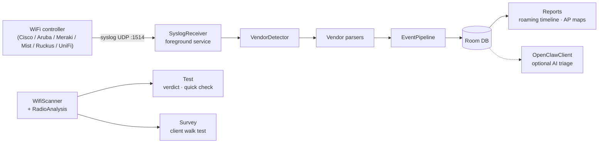

# Signal & Flow

**Turns an Android phone into a wireless field diagnostic sensor that hands you verdicts, not packet dumps.**


Point a wireless LAN controller's syslog at the phone and replay a roaming incident:

```bash
$ while IFS= read -r line; do
    echo "$line" | nc -u <phone-ip> 1514
    sleep 0.2
  done < testdata/cisco-9800-roaming.log
```

| Sample log (`testdata/`) | Contents | Parsed by SIGNAL |
|---|---|---|
| `cisco-9800-roaming.log` | 2 clients roaming across APs, deauth, auth failure | 8 events (3 ROAM, ASSOC, AUTH, DEAUTH, DISASSOC) |
| `cisco-aireos-classic.log` | AireOS 5520 associations and deauths | 6 events |
| `mixed-noise.log` | WLC + switch + firewall syslog mixed together | 3 events — non-WiFi lines ignored |

On screen, the Test tab answers first and shows evidence second: a 38 pt verdict ("Looking good" / "Needs attention") with the probable cause underneath — "Channel contention is affecting this area", "Coverage is weak at this spot" — computed locally from live scan statistics, no cloud required.

## What is Signal & Flow

A native Android app (Kotlin, Jetpack Compose) that turns the phone in your backpack into the instrument you walk a site with. It combines live WiFi scanning with local statistical RF assessment, captures enterprise-controller syslog over UDP, reconstructs client roaming timelines, and exports session reports — designed to run continuously during a site survey without any cloud dependency.

Built for one workflow: field wireless diagnostics. Bottom tabs are outcomes, not features — **Test**, **Survey**, **Investigate**, **Reports**.

## Why it's different

| Capability | Mechanism |
|---|---|
| Verdict-first testing | `RadioAnalysis` scores the RF environment 0–100 (EXCELLENT / GOOD / DEGRADED / CRITICAL) from median RSSI, channel congestion, and band distribution — deterministic, on-device, offline |
| Simple and Engineer modes | One toggle, same measurements — plain-language verdict or full statistical detail ("Same measurements. Different detail.") |
| One-tap Quick Check | Scan + download speed test in a single button press |
| Client walk test | Phone-only survey mode: walk the floor, capture a spot, build coverage evidence without controller access |
| Controller syslog capture | Foreground service holds a UDP socket (default `:1514`) alive while you walk; handles bursty roaming storms |
| Six vendor parsers | Strategy-pattern parsers with a `VendorDetector` that ignores non-WiFi noise |
| Roaming timelines | Parsed events land in Room; Reports reconstructs per-client roam history and AP maps |
| Alerts and exports | `AlertEngine` notifications, CSV session export, session report builder, data retention manager |
| Optional AI triage | `OpenClawClient` POSTs an event bundle to a local [OpenClaw](https://openclaw.ai) gateway; every core feature works with it absent |

### Supported controllers

| Vendor | Formats parsed |
|---|---|
| Cisco WLC | 9800 IOS-XE and AireOS — association, roaming, deauth, auth failure |
| Aruba | Mobility Controller (AOS-8) / AOS-CX — `authmgr` / `stm` events |
| Cisco Meraki | MR flat `key=value` event log |
| Juniper Mist | JSON / `key=value` client events |
| Ruckus | SmartZone / Unleashed `STA-*` messages |
| Ubiquiti UniFi | hostapd and UniFi OS formats |

## Architecture



Offline-first by design: syslog capture, parsing, storage, scoring, and reporting all run on the phone. The only external dependency for core features is the controller sending syslog to the phone's IP. Full rationale in [docs/architecture.md](docs/architecture.md) and [docs/architecture/data-flow.md](docs/architecture/data-flow.md).

## Quick Start

**Prerequisites:** Android Studio (Ladybug or later), JDK 11+, device or emulator on API 29+ (Android 10).

```bash
git clone https://github.com/bgorzelic/signal-app.git
cd signal-app

./gradlew assembleDebug        # Build debug APK
./gradlew installDebug         # Install on connected device
./gradlew test                 # Unit tests
./gradlew connectedAndroidTest # Instrumented tests on device
./gradlew lint                 # Android lint
```

To feed it data without a controller, use the sample logs in [`testdata/`](testdata/README.md) — via UDP replay (above) or paste into Investigate → Import.

## Project Structure

```
app/src/main/java/dev/aiaerial/signal/
├── data/
│   ├── parser/      # 6 vendor syslog parsers + VendorDetector
│   ├── syslog/      # UDP syslog receiver
│   ├── wifi/        # Scanner, RadioAnalysis, channel utilization, speed test
│   ├── local/       # Room database, DAOs
│   ├── alert/       # Alert engine + notifier
│   ├── export/      # CSV export, session reports
│   ├── openclaw/    # Optional AI gateway client
│   └── EventPipeline.kt
├── service/         # SyslogService (foreground service)
└── ui/              # Compose screens: test, survey, syslog, timeline,
                     # triage, logimport, settings + Material 3 theme
```

## Tech Stack

| Component | Technology |
|---|---|
| Language | Kotlin 2.0 |
| UI | Jetpack Compose + Material 3 |
| DI | Hilt |
| Database | Room (SQLite) |
| Networking | Ktor (UDP syslog), OkHttp (HTTP) |
| Min / Target SDK | 29 (Android 10) / 36 |

## Related Projects

- [OpenClaw](https://openclaw.ai) — AI gateway that processes triage requests from SIGNAL
- [openclaw-android-edge](https://github.com/bgorzelic/openclaw-android-edge) — Deployment guide for the Pixel 10a edge node

## Status

Active development, pre-release. Version 0.7.0 rebuilds the app around the unified field workflow: plain-language Simple mode, an expandable Wireless Engineer mode using the same measurements, one-tap Quick Check, outcome-based navigation, and a phone-only client walk test.
